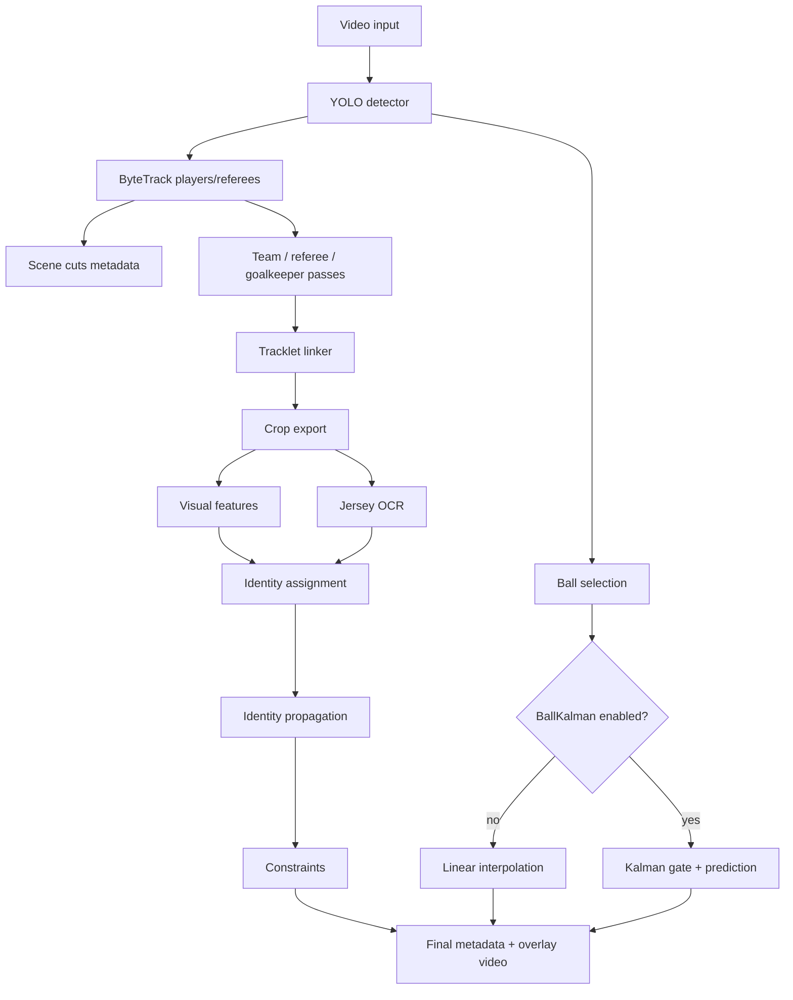

# FT Workflow Guide

Questa guida serve a riprendere il lavoro senza dover ricostruire tutta la conversazione.

Il progetto operativo e' in:

```text
/Users/lorenzocappetti/Downloads/Football-Tracking-main/FT
```

La macchina remota con dati, video e modelli e':

```text
/home/cappetti/FT
```

## In Una Frase

La baseline stabile per tracking/identity e':

```text
configs/default_realvideo_ocr_nopromote_rawgate020_scenecuts_loose_noreset_gkfallback_spreadgate_propagation_linker_legacyappearance.yaml
```

La config sperimentale migliore per la palla e':

```text
configs/default_realvideo_ocr_nopromote_rawgate020_scenecuts_loose_noreset_gkfallback_spreadgate_propagation_ballkalman.yaml
```

Non promuovere ancora OSNet, ByteTrack tuned, o `hsv_lab_gradient` come default.

## Schema Pipeline



## Come Scegliere La Config

### Voglio una run stabile per identity/OCR

Usa:

```text
configs/default_realvideo_ocr_nopromote_rawgate020_scenecuts_loose_noreset_gkfallback_spreadgate_propagation_linker_legacyappearance.yaml
```

Questa e' la linea da confrontare contro tutto il resto.

### Voglio migliorare la palla/overlay

Usa:

```text
configs/default_realvideo_ocr_nopromote_rawgate020_scenecuts_loose_noreset_gkfallback_spreadgate_propagation_ballkalman.yaml
```

Questa tiene identita' invariata nei test fatti e riduce molto i salti della palla.

### Voglio testare OSNet ReID

Usa:

```text
configs/default_realvideo_ocr_nopromote_rawgate020_scenecuts_loose_noreset_gkfallback_spreadgate_propagation_linker_osnet.yaml
```

Oppure, solo se vuoi testare gate spaziali piu' larghi:

```text
configs/default_realvideo_ocr_nopromote_rawgate020_scenecuts_loose_noreset_gkfallback_spreadgate_propagation_linker_osnet_widedistance.yaml
```

Nota: OSNet e' integrato e funziona se `torchreid` e' installato, ma nei test su `Int-Ata` e `Inter-Juve` non ha migliorato i risultati finali.

### Voglio provare ByteTrack tuned

Config:

```text
configs/default_realvideo_ocr_nopromote_rawgate020_scenecuts_loose_noreset_gkfallback_spreadgate_propagation_broadcast_bytetrack_tuned.yaml
```

Non consigliata come baseline: il tuning ByteTrack piu' aggressivo aveva ridotto evidenza OCR in test precedenti.

## File Principali E Cosa Fanno

### CLI e pipeline

```text
ft/cli.py
```

Entry point. Il comando remoto usa:

```bash
python3 -m ft.cli run ...
```

Legge config YAML, applica override CLI, poi chiama la pipeline.

```text
ft/pipeline.py
```

Orchestra tutto:

- legge video;
- costruisce tracker;
- esegue scene cuts;
- team/referee/goalkeeper;
- linking;
- export crops;
- visual features;
- OCR maglie;
- assignment identita';
- propagation;
- constraints;
- scrive metadata e video finale.

Funzioni importanti:

- `build_tracker(...)`
- `ball_tracking_diagnostics(...)`
- `_run_pipeline_impl(...)`

### Config e validazione

```text
ft/config.py
```

Default Python della configurazione. Attenzione: molti YAML ereditano da `configs/default.yaml`, dove storicamente c'e':

```yaml
max_frames: 300
```

Per fare una run full serve una config con:

```yaml
max_frames: null
```

```text
ft/validation.py
```

Controlla config prima della run. Blocca errori evidenti e stampa warning, per esempio:

- StrongSORT senza opt-in;
- OCR multi-backend senza `aggregate_by_crop`;
- valori negativi nei parametri palla/linker.

### Tracking

```text
ft/tracking/yolo_bytetrack.py
```

Tracker principale consigliato. Fa:

- YOLO detection;
- ByteTrack per players/referees;
- selezione palla separata;
- interpolazione/predizione palla;
- output tracks.

Parametri importanti:

```yaml
detection:
  ball_confidence: 0.002
  ball_max_area_ratio: 0.0015
  ball_temporal_consistency: false
  ball_kalman_enabled: false
```

La palla temporale classica resta disattivata di default, perche' aveva peggiorato la palla.

```text
ft/tracking/ball_kalman.py
```

Kalman per la palla. Stato:

```text
[x, y, dx, dy, ddx, ddy]
```

Serve per:

- predire palla durante occlusioni brevi;
- evitare salti impossibili;
- allargare area ratio quando la palla e' veloce/blurred.

Non e' default. Si attiva con:

```yaml
detection:
  ball_kalman_enabled: true
```

```text
ft/tracking/yolo_strongsort.py
```

Tracker sperimentale. Non usarlo come baseline. Richiede:

```yaml
tracking:
  backend: strongsort
  strongsort:
    allow_experimental: true
```

### Linking tracklet

```text
ft/linking/tracklet_linker.py
```

Collega tracklet spezzati. Ora:

- considera candidati piu' vicini temporalmente;
- limita candidati con `max_temporal_candidates`;
- usa `embedding_mode`;
- gestisce soglia diversa per HSV.

Parametri utili:

```yaml
linking:
  embedding_mode: hsv
  appearance_min_similarity: 0.72
  appearance_min_similarity_hsv: 0.72
  max_temporal_candidates: 50
```

### Visual features / ReID

```text
ft/features/visual.py
```

Estrae embedding visuali:

- `hsv`
- `hsv_lab_gradient`
- `osnet`

`osnet` fa fallback a HSV se mancano dipendenze.

```text
ft/features/reid_extractor.py
```

Wrapper opzionale OSNet con `torchreid`.

Nei test:

- `torchreid` sul remoto funzionava;
- OSNet era `reid_status: ok`;
- ma i risultati finali erano identici a legacy.

### OCR maglie

```text
ft/features/jersey_ocr.py
```

Gestisce crop, preprocess variants, backend OCR, aggregazione per crop e voting.

Punto importante: con:

```yaml
jersey_ocr:
  aggregate_by_crop: true
```

MMOCR + EasyOCR non gonfiano i voti come osservazioni indipendenti dello stesso crop.

### Identity

```text
ft/identity/hungarian.py
ft/identity/propagation.py
ft/identity/constraints.py
```

Ruoli:

- `hungarian.py`: assignment globale tracklet -> roster player.
- `propagation.py`: propaga identita' tra display tracklets compatibili.
- `constraints.py`: pulisce conflitti, duplicati, goalkeeper-only jersey, team/frame conflicts.

### Export / overlay

```text
ft/export/artifacts.py
ft/visualization/overlay.py
```

Scrivono:

- CSV finali;
- tracklet summaries;
- crops;
- overlay video.

## Config Importanti

### Stabile identity

```text
configs/default_realvideo_ocr_nopromote_rawgate020_scenecuts_loose_noreset_gkfallback_spreadgate_propagation_linker_legacyappearance.yaml
```

Uso consigliato per confronti.

### Full stabile identity

```text
configs/default_realvideo_ocr_nopromote_rawgate020_scenecuts_loose_noreset_gkfallback_spreadgate_propagation_linker_legacyappearance_full.yaml
```

Serve quando vuoi evitare il limite `max_frames: 300`.

### Palla Kalman

```text
configs/default_realvideo_ocr_nopromote_rawgate020_scenecuts_loose_noreset_gkfallback_spreadgate_propagation_ballkalman.yaml
```

Attiva:

```yaml
detection:
  ball_kalman_enabled: true
```

### OSNet

```text
configs/default_realvideo_ocr_nopromote_rawgate020_scenecuts_loose_noreset_gkfallback_spreadgate_propagation_linker_osnet.yaml
```

### OSNet con gate piu' largo

```text
configs/default_realvideo_ocr_nopromote_rawgate020_scenecuts_loose_noreset_gkfallback_spreadgate_propagation_linker_osnet_widedistance.yaml
```

### ByteTrack tuned

```text
configs/default_realvideo_ocr_nopromote_rawgate020_scenecuts_loose_noreset_gkfallback_spreadgate_propagation_broadcast_bytetrack_tuned.yaml
```

Non promossa.

### YOLO training augmentation

```text
scripts/train_yolo_gsr_full.py
```

Ramo separato per riallenare YOLO. Non mischiare con test pipeline se vuoi capire cosa cambia.

## Run Recipes

### Run stabile 1200f

```bash
RUN=Int-Ata_scenecuts_loose_noreset_gkfallback_spreadgate_propagation_strict_linker_legacyappearance_1200f
mkdir -p logs output_videos/costume-video artifacts/costume-video

PYTHONDONTWRITEBYTECODE=1 PYTHONPATH=/home/cappetti/FT \
nohup python3 -m ft.cli run \
  --config configs/default_realvideo_ocr_nopromote_rawgate020_scenecuts_loose_noreset_gkfallback_spreadgate_propagation_linker_legacyappearance.yaml \
  --video-path costume-video/Int-Ata/Int-Ata.mp4 \
  --model-path best_yolo26x_gsr_light.pt \
  --output-path output_videos/costume-video/${RUN}.mp4 \
  --artifacts-dir artifacts/costume-video/${RUN} \
  --roster-path costume-video/Int-Ata/Int-Ata.json \
  --max-frames 1200 \
  --wandb-name ${RUN} \
  > logs/${RUN}.log 2>&1 &

tail -f logs/${RUN}.log
```

### Run palla Kalman breve

```bash
RUN=Inter-Atalanta_scenecuts_loose_noreset_gkfallback_spreadgate_propagation_ballkalman_gate_500f
mkdir -p logs output_videos/costume-video artifacts/costume-video

PYTHONDONTWRITEBYTECODE=1 PYTHONPATH=/home/cappetti/FT \
nohup python3 -m ft.cli run \
  --config configs/default_realvideo_ocr_nopromote_rawgate020_scenecuts_loose_noreset_gkfallback_spreadgate_propagation_ballkalman.yaml \
  --video-path costume-video/Inter-Atalanta/Inter-Atalanta.mp4 \
  --model-path best_yolo26x_gsr_light.pt \
  --output-path output_videos/costume-video/${RUN}.mp4 \
  --artifacts-dir artifacts/costume-video/${RUN} \
  --roster-path costume-video/Inter-Atalanta/Inter-Atalanta.json \
  --max-frames 500 \
  --wandb-name ${RUN} \
  > logs/${RUN}.log 2>&1 &

tail -f logs/${RUN}.log
```

### Full run senza limite frame

Se la config eredita `max_frames: 300`, crea una config full:

```bash
cat > configs/MY_CONFIG_full.yaml <<'YAML'
base_config: MY_CONFIG.yaml

max_frames: null
YAML
```

Poi lancia senza `--max-frames`.

## Audit Recipes

### Audit run

```bash
python3 scripts/audit_realvideo_runs.py \
  --video-id Inter-Atalanta \
  --run RUN_A \
  --run RUN_B
```

### Diagnostica palla

```bash
python3 - <<'PY'
import json
from pathlib import Path

runs = [
    "RUN_A",
    "RUN_B",
]
video_id = "Inter-Atalanta"

for run in runs:
    root = Path("artifacts/costume-video") / run / "metadata"
    path = root / f"{video_id}_ball_tracking.json"
    print("\n==", run)
    print("exists", path.exists())
    if not path.exists():
        continue
    data = json.loads(path.read_text())
    for key in [
        "total_frames",
        "ball_frames",
        "detected_frames",
        "interpolated_frames",
        "mean_detection_confidence",
        "max_detected_jump_px",
        "p95_detected_jump_px",
        "max_gated_detected_jump_px",
        "p95_gated_detected_jump_px",
        "max_reacquisition_jump_px",
    ]:
        print(key, data.get(key))
    print("largest_jumps", data.get("largest_detected_jumps", [])[:8])
PY
```

### Diagnostica linker

```bash
python3 - <<'PY'
import json
from pathlib import Path

run = "RUN_NAME"
video_id = "Inter-Juve"
path = Path("artifacts/costume-video") / run / "metadata" / f"{video_id}_linking.json"
data = json.loads(path.read_text())
print("accepted_links", len(data.get("accepted_links", [])))
print("rejections", data.get("rejection_counts"))
print("settings", data.get("settings"))
print("first_links", data.get("accepted_links", [])[:10])
PY
```

## Risultati Gia' Ottenuti

### Int-Ata

`legacyappearance` e baseline strict sono identiche:

- `rows`: `16423`
- `assigned_rows`: `6197`
- `candidate_rows`: `2096`
- `jersey_rows`: `6261`
- `propagated_rows`: `336`
- duplicati: `0`

### Inter-Juve

Legacy vs OSNet 1200f:

- risultati finali identici;
- OSNet attivo (`reid_status: ok`);
- collo di bottiglia: `distance`, non appearance.

### Inter-Atalanta

Legacy vs BallKalman:

Identity invariata:

- `rows`: `3761`
- `assigned_rows`: `2178`
- `candidate_rows`: `971`
- `propagated_rows`: `159`
- duplicati: `0`

Palla migliorata:

- `p95_detected_jump_px`: `556 -> 21`
- `max_reacquisition_jump_px`: `1035 -> 82`

## Decisioni

### Promuovere come stabile

- `legacyappearance` per identity/tracking persone.

### Tenere come esperimento buono

- `ballkalman` per overlay/analisi palla.

### Non promuovere

- `hsv_lab_gradient` come linker default.
- OSNet come default.
- ByteTrack tuned.
- StrongSORT.

## Cosa Fare Nella Prossima Chat

1. Aprire questo file.
2. Se si lavora su identity, partire da `legacyappearance`.
3. Se si lavora sulla palla, partire da `ballkalman`.
4. Non mischiare YOLO retraining con pipeline tracking, a meno che l'obiettivo sia esplicitamente testare un nuovo detector.
5. Dopo ogni run, fare sempre:
   - `scripts/audit_realvideo_runs.py`
   - diagnostica palla o linker, a seconda dell'esperimento.

## Test Locali Utili

```bash
cd /Users/lorenzocappetti/Downloads/Football-Tracking-main/FT

PYTHONPATH=. python3 tests/test_ball_tracking.py
PYTHONPATH=. python3 tests/test_ball_kalman.py
python3 -m py_compile ft/tracking/yolo_bytetrack.py ft/tracking/ball_kalman.py ft/features/visual.py ft/features/reid_extractor.py ft/pipeline.py ft/config.py ft/validation.py
```

Nota: alcune dipendenze complete (`cv2`, `yaml`, `torchreid`, MMOCR) possono mancare in locale. Le run complete vanno fatte sul remoto `mmocr`.
